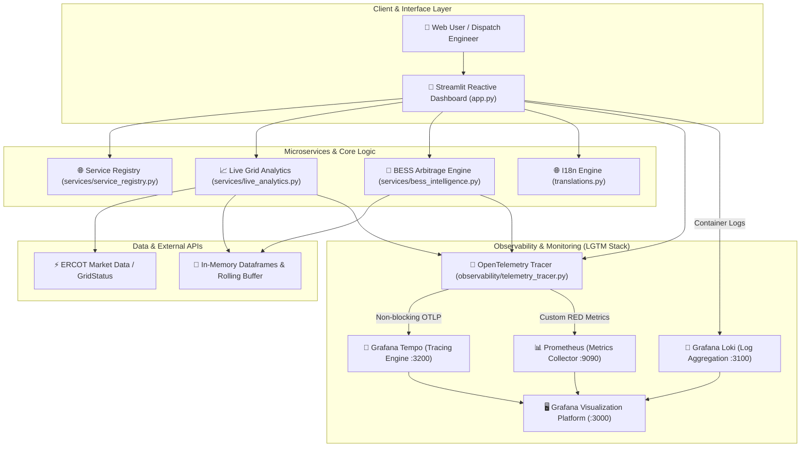
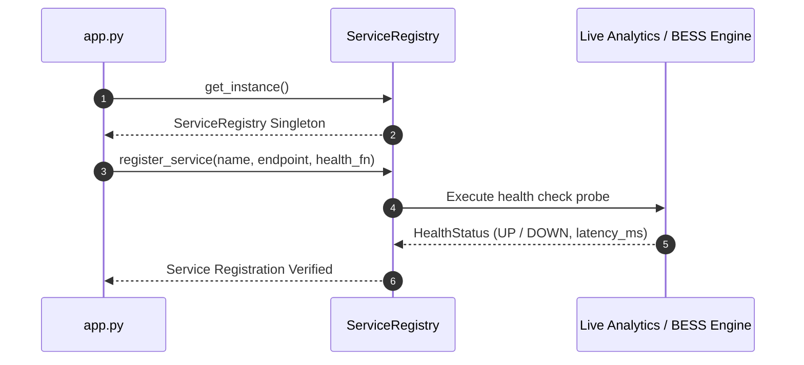
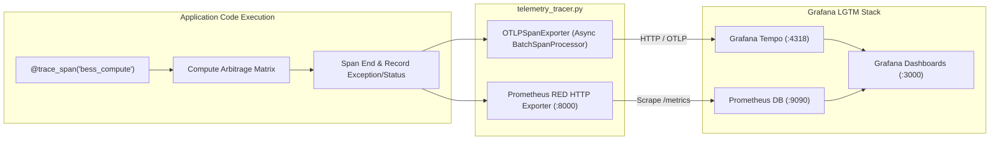
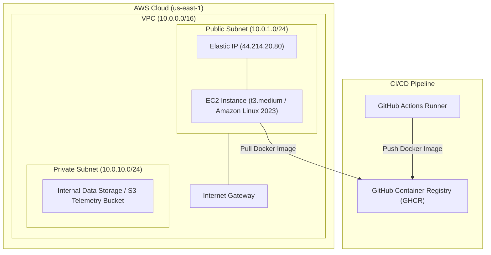

# 📐 Technical Architecture Specification — GridFlow-TX

This document provides a deep technical architecture specification for the **GridFlow-TX** platform, detailing its component topology, telemetry tracing pipelines, machine learning forecasting engine, and infrastructure automation models.

---

## 1. High-Level Component Topology



---

## 2. Microservices Gateway & Service Registry Design

The microservices hub uses a decentralized registry pattern defined in [`services/service_registry.py`](file:///home/joanr/agentic-platforms/GridFlow-TX/services/service_registry.py).

### Registered Modules
- `live_analytics`: Fetches real-time ERCOT frequency, system load, and zonal LMPs.
- `bess_intelligence`: Handles ML feature extraction, price ranking, and financial arbitrage matrix generation.
- `observability`: Monitors OpenTelemetry exporter health and Prometheus RED metrics endpoint.



---

## 3. BESS Machine Learning & Financial Arbitrage Engine

The BESS Arbitrage Engine ([`services/bess_intelligence.py`](file:///home/joanr/agentic-platforms/GridFlow-TX/services/bess_intelligence.py)) converts raw ERCOT Locational Marginal Prices (LMP) into actionable charge/discharge schedules.

### Mathematical Formulation
Given an array of predicted hourly prices $P = [p_1, p_2, \dots, p_T]$ over horizon $T \in \{8, 16, 24\}$ hours:

1. **Optimal Charging Hours ($C$)**:
   $$C = \arg\min_{t \in T, |C|=k} \sum_{t \in C} p_t$$
2. **Optimal Discharging Hours ($D$)**:
   $$D = \arg\max_{t \in T, |D|=k} \sum_{t \in D} p_t \quad \text{subject to } t_D > t_C$$
3. **Gross Financial Yield ($Y_{\text{gross}}$)**:
   $$Y_{\text{gross}} = \sum_{t \in D} (p_t \cdot \eta_{\text{discharge}}) - \sum_{t \in C} \left(\frac{p_t}{\eta_{\text{charge}}}\right)$$
4. **Net Arbitrage Profit ($Y_{\text{net}}$)**:
   $$Y_{\text{net}} = Y_{\text{gross}} - \text{Degradation Cost} - \text{O\&M Expenses}$$

---

## 4. Telemetry & Observability Pipeline

Distributed tracing and metric gathering are implemented in [`observability/telemetry_tracer.py`](file:///home/joanr/agentic-platforms/GridFlow-TX/observability/telemetry_tracer.py).



### RED Metrics Specification
- **Request Rate (`gridflow_requests_total`)**: Counter tracking total API & analytics requests segmented by route.
- **Error Count (`gridflow_errors_total`)**: Counter tracking exception rates across microservice operations.
- **Execution Duration (`gridflow_request_duration_seconds`)**: Histogram measuring end-to-end processing latency.

---

## 5. Infrastructure & Deployment Model

The cloud architecture is specified declaratively in [`terraform/`](file:///home/joanr/agentic-platforms/GridFlow-TX/terraform) and configured via [`ansible/`](file:///home/joanr/agentic-platforms/GridFlow-TX/ansible).



---

## 6. Directory Structure Overview

```
GridFlow-TX/
├── app.py                      # Main Streamlit Application Entrypoint
├── dashboard.py                # Core Dashboard Rendering & UI Layout
├── translations.py             # Internationalization Dictionary (EN / ES)
├── requirements.txt            # Python Dependencies Specification
├── docker-compose.yml          # Container Orchestration (LGTM Stack + App)
├── Dockerfile                  # Production Multi-Stage Container Spec
├── README.md                   # Project Overview & Quickstart Guide
├── ARCHITECTURE.md             # Deep Technical Architecture Specification
├── services/
│   ├── bess_intelligence.py    # BESS Energy Arbitrage ML Engine
│   ├── live_analytics.py       # ERCOT Real-time Data Ingestion Engine
│   └── service_registry.py     # Microservices Gateway Hub & Registry
├── observability/
│   ├── telemetry_tracer.py     # OpenTelemetry & Prometheus RED Exporter
│   ├── grafana/                # Pre-configured Dashboards & Datasources
│   ├── prometheus/             # Prometheus Scrape Configurations
│   ├── tempo/                  # Grafana Tempo Tracing Configuration
│   ├── loki/                   # Grafana Loki Configuration
│   └── promtail/               # Promtail Container Log Configuration
├── terraform/                  # Infrastructure as Code (AWS VPC, EC2, S3)
├── ansible/                    # Configuration Management & Deployment Playbooks
└── tests/                      # Automated Pytest Suite (100% Pass Rate)
```
