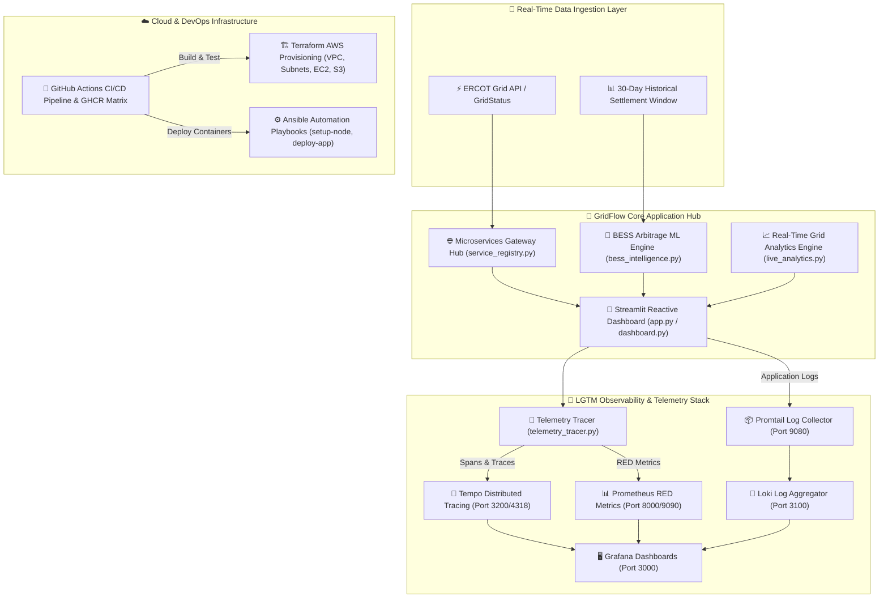
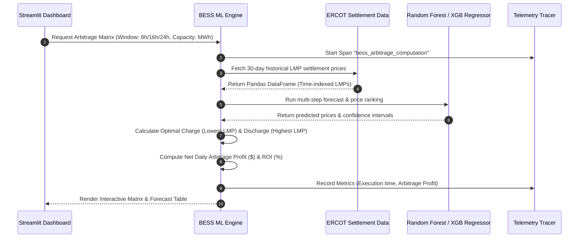

# ⚡ GridFlow-TX: ERCOT Real-Time Grid Analytics & BESS Arbitrage Intelligence Platform

[](https://www.python.org/)
[](https://streamlit.io/)
[](https://grafana.com/)
[](https://www.terraform.io/)
[](https://www.ansible.com/)
[](https://www.docker.com/)
[](https://github.com/features/actions)

---

## 📌 Executive Summary

**GridFlow-TX** is an enterprise-grade, real-time energy analytics and Battery Energy Storage System (**BESS**) price arbitrage intelligence platform designed for the **Texas ERCOT (Electric Reliability Council of Texas)** power grid market. 

The platform aggregates real-time electric grid settlement prices, system demand, and generation mix to provide predictive machine learning models for battery storage arbitrage operations. It features a complete **LGTM (Loki, Grafana, Tempo, Prometheus)** observability stack with **OpenTelemetry** distributed tracing, automated **Terraform** infrastructure provisioning on AWS, and zero-downtime **Ansible** configuration management.

---

## 🏛️ System Architecture

GridFlow-TX follows an event-driven microservices hub architecture supported by full-stack observability and automated cloud deployment pipelines.



---

## 🔋 BESS Arbitrage & Machine Learning Pipeline

The BESS Intelligence Engine analyzes historical price volatility and predicts optimal charge/discharge windows across flexible horizons (**8h, 16h, 24h**).



---

## 🛠️ Key Capabilities & Features

### 1. 🌐 Microservices Gateway Hub & Dynamic Registry
- Dynamic health checks and uptime monitoring for internal services.
- Real-time routing state across core modules (`live_analytics`, `bess_intelligence`, `observability`).

### 2. 🔋 BESS Energy Arbitrage Matrix
- **Flexible Time Horizons**: Selectable prediction windows for **8 hours, 16 hours, and 24 hours**.
- **Financial Arbitrage Modeling**: Calculates round-trip efficiency losses, degradation estimates, net profit ($), and return on investment (ROI %).
- **Interactive Prediction Tables**: Detailed breakdown of hourly prices, charge recommendations, and peak discharge slots.

### 3. 📈 ERCOT Real-Time Analytics
- **Live System Demand & Frequency**: Monitors Texas grid load (MW) and grid frequency stability (Hz).
- **Zonal Locational Marginal Prices (LMP)**: Real-time price tracking across Houston, North, South, and West ERCOT congestion zones.
- **Fuel Generation Mix**: Visualizes wind, solar, natural gas, nuclear, and coal power output percentages.

### 4. 🔭 LGTM Dual-Layer Observability & OpenTelemetry
- **Asynchronous Non-Blocking Tracing**: OpenTelemetry spans export via background threads without blocking main UI execution.
- **Custom RED Metrics**: Tracks Request Rate, Error Count, and Execution Duration exposed via Prometheus endpoints (`:8000` and `:8501`).
- **Pre-Configured Grafana Dashboards**: Dual-layer monitoring for microservices RED performance and waterfall distributed trace analysis in Grafana.

### 5. ☁️ DevOps & Infrastructure as Code (IaC)
- **Terraform AWS Infrastructure**: Automated VPC, public/private subnets, Security Groups, EC2 instances, and S3 telemetry storage.
- **Ansible Playbooks**: Automated node configuration, Docker installation, and one-command deployment (`ansible/playbooks/deploy-app.yml`).
- **GitHub Actions CI/CD**: Automated unit test execution via `pytest`, Security Component Analysis (SCA) scans, and multi-environment container image publishing to **GHCR**.

---

## 🌐 Services & Ports Map

| Component | Technology | Default Port | Description |
| :--- | :--- | :--- | :--- |
| **Streamlit Dashboard** | Python / Streamlit | `8501` | Interactive User Interface & Analytics Portal |
| **RED Metrics Server** | Prometheus Client | `8000` | Custom RED (Rate, Error, Duration) Metrics Endpoint |
| **Grafana** | Grafana LGTM | `3000` | Unified Telemetry, Log & Distributed Trace Dashboards |
| **Prometheus** | Prometheus | `9090` | Metrics Collector & Time-Series Database |
| **Tempo** | Grafana Tempo | `3200` / `4318` | OpenTelemetry OTLP/HTTP Distributed Tracing Sink |
| **Loki** | Grafana Loki | `3100` | Centralized Log Aggregation Engine |
| **Promtail** | Grafana Promtail | `9080` | Container Log Shipper for Loki |

---

## 💻 Quickstart & Local Setup Guide

### Option 1: Running with Docker Compose (Recommended)

1. **Clone the Repository**:
   ```bash
   git clone https://github.com/joanroamora/GridFlow-TX.git
   cd GridFlow-TX
   ```

2. **Launch the Full Application Stack**:
   ```bash
   docker-compose up -d
   ```

3. **Access Services**:
   - **Streamlit App**: [http://localhost:8501](http://localhost:8501)
   - **Grafana Observability**: [http://localhost:3000](http://localhost:3000) (Anonymous admin enabled)
   - **Prometheus Metrics**: [http://localhost:9090](http://localhost:9090)

---

### Option 2: Manual Python Environment Setup

1. **Create and Activate a Virtual Environment**:
   ```bash
   python3 -m venv .venv
   source .venv/bin/activate
   ```

2. **Install Dependencies**:
   ```bash
   pip install -r requirements.txt
   ```

3. **Run the Streamlit Dashboard**:
   ```bash
   streamlit run app.py
   ```

---

## 🧪 Testing & Quality Assurance

GridFlow-TX includes a comprehensive automated test suite covering analytics, BESS intelligence algorithms, service registries, and telemetry tracing.

```bash
# Run pytest using the virtual environment
.venv/bin/pytest tests/ -v
```

### Test Suite Summary
- `tests/test_bess_intelligence.py`: Validates ML price forecasts and financial arbitrage ROI calculations.
- `tests/test_dashboard.py`: Verifies Streamlit UI layout logic, time windows, and multi-language translations.
- `tests/test_observability.py`: Ensures non-blocking OpenTelemetry spans and Prometheus RED metrics generation.
- `tests/test_service_registry.py`: Tests Gateway Hub service registration and health probes.
- `tests/test_translations.py`: Validates internationalization dictionaries (EN/ES).

---

## 🚀 DevOps & CI/CD Deployment

### Terraform AWS Provisioning
```bash
cd terraform
terraform init
terraform plan
terraform apply
```

### Ansible Automated Deployment
```bash
cd ansible
ansible-playbook -i inventory.ini playbooks/setup-node.yml
ansible-playbook -i inventory.ini playbooks/deploy-app.yml
```

---

## 📄 License & Author

Developed with ❤️ by **Joan Roa** ([@joanroamora](https://github.com/joanroamora)).  
Project Repository: [GridFlow-TX](https://github.com/joanroamora/GridFlow-TX)

Released under the **MIT License**.
